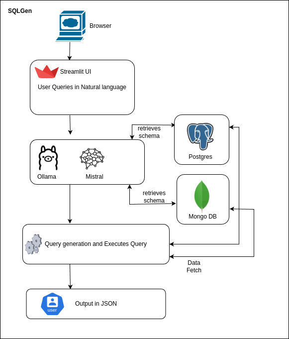

# SQLGen Application

---

## 1. Overview of the Application

**SQLGen** is a powerful Natural Language to Database Query application.  
It enables users to interact with **PostgreSQL** and **MongoDB** databases simply by typing queries in **plain English** through a **Streamlit**-based web interface.

Built with **Ollama** and **Mistral** language models, SQLGen intelligently understands the user's natural language query, determines the correct database (PostgreSQL or MongoDB) to target, automatically generates the appropriate SQL or MongoDB query, executes it on the respective database, and then presents the output neatly in **JSON format**.

This application eliminates the need for users to know SQL or MongoDB syntax — they can query complex data just by using natural language!

---

## 2. Workflow and Architecture of the Application

### High-Level Workflow:

1. The user opens a browser and accesses the **Streamlit** UI.
2. The user submits a query in **natural language**.
3. The application retrieves the **schemas** of both **PostgreSQL** and **MongoDB** databases.
4. The **Mistral** model via **Ollama** decides whether the query should be executed on PostgreSQL or MongoDB based on the schemas.
5. Depending on the decision:
   - If **PostgreSQL**, it generates a valid **SQL** query.
   - If **MongoDB**, it generates a valid **MongoDB** query JSON.
6. The application executes the generated query on the correct database.
7. It fetches and presents the **query result in JSON format** back to the user.

---

### Architecture Diagram:

> **Architecture of SQLGen Application**

**Description:**
- Users interact via **Streamlit UI**.
- **Ollama** (running the **Mistral** model) is used for:
  - Deciding database selection.
  - Generating the appropriate query.
- The app retrieves schema metadata from **PostgreSQL** and **MongoDB**.
- Based on model-generated query, it fetches **data from the correct database**.
- Final output is returned to the user in **JSON** format.

---

## 3. Example Queries to Try

Here are some sample questions you can try inside the application to understand its capability:

**For PostgreSQL-related queries:**
- 🔹 "List all laptops available in stock."
- 🔹 "Show me all gaming laptops priced under 2500."
- 🔹 "Which brand has the most expensive laptop?"
- 🔹 "Show me all the HP branded laptops"

**For MongoDB-related queries:**
- 🔹 "Show customer reviews for the laptop with id 4"
- 🔹 "Find all laptops that have received at least a 4-star rating."
- 🔹 "Show me all reviews mentioning 'battery life'."
- 🔹 "Show me all the customer reviews of the laptops with rating 5."

---

# How to Use SQLGen via Streamlit

1. Launch the application in browser.
2. Enter your **query** in the text input box.
3. Click **"Run Query"**.
4. Wait while the model:
   - Retrieves schemas.
   - Determines the database.
   - Generates and executes the query.
5. View the **Generated SQL/MongoDB Query** and **Final Results**.
6. Results will be displayed in **JSON** format for easy understanding.

   .png)
   .png)

---

# Key Points to Note
- Streamlit UI handles user inputs seamlessly.
- Ollama (Mistral model) is responsible for intelligent reasoning and query formation.
- Both **structured (PostgreSQL)** and **semi-structured (MongoDB)** databases are supported.
- No need to manually know SQL or MongoDB syntax — the application does it for you!

---

